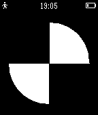

# gpath-bezier

Drawing complex paths requires a lot of manual work on Pebble. You can do this
efficiently and quickly using a Pebble-optimized ``GPath`` algorithm and Bezier
curves.

This library introduces the `GPathBuilder` API that allows you to
programmatically contruct `GPath` objects by specifying start and end points for
a curve. The builder than adds intermetiary points to make the curve as smooth
as is practical.

## Code Example

You can draw the path shown above using only the `GPathBuilder` code below:

    // Create GPathBuilder object
    GPathBuilder *builder = gpath_builder_create(MAX_POINTS);

    // Move to the starting point of the GPath
    gpath_builder_move_to_point(builder, GPoint(0, -60));
    // Create curve
    gpath_builder_curve_to_point(builder, GPoint(60, 0), GPoint(35, -60), GPoint(60, -35));
    // Create straight line
    gpath_builder_line_to_point(builder, GPoint(-60, 0));
    // Create another curve
    gpath_builder_curve_to_point(builder, GPoint(0, 60), GPoint(-60, 35), GPoint(-35, 60));
    // Create another straight line
    gpath_builder_line_to_point(builder, GPoint(0, -60));

    // Create GPath object out of our GPathBuilder object
    s_path = gpath_builder_create_path(builder);
    // Destroy GPathBuilder object
    gpath_builder_destroy(builder);

    // Get window bounds
    GRect bounds = layer_get_bounds(window_get_root_layer(window));
    // Move newly created GPath to the center of the screen
    gpath_move_to(s_path, GPoint((int16_t)(bounds.size.w/2), (int16_t)(bounds.size.h/2)));

## More Information

You can learn more about Bezier curves by reading the Pebble Developers blog 
post 
[*Bezier Curves and GPaths on Pebble*](https://developer.getpebble.com//blog/2015/02/13/Bezier-Curves-And-GPaths/).